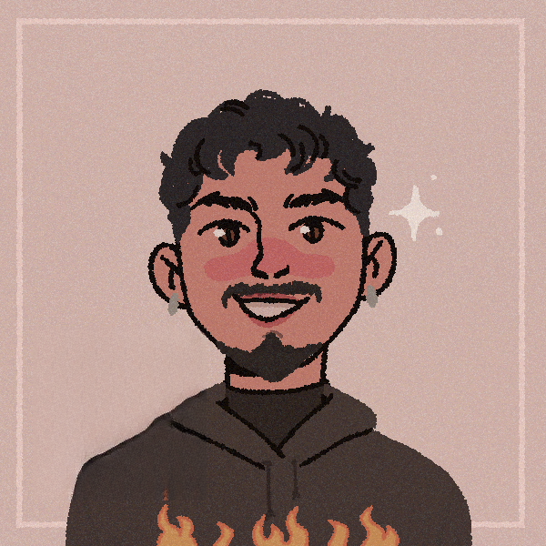

<h2 align="left">Olá eu sou o Josineudo Arruda 🧑‍💻</h2>

###

  
  

###

###

  
  
  
  
  
  
  
  
  
  
  
  
  
  
  
  
  
  
  

###

  
  

###

- 🚀 Estou atualmente cursando PROPROFISSÃO no Instituto PROA, curso de desenvolvimento de software em Java e React.
- 🔭 No 2° semestre de Engenharia da Computação na FMU.
- 🌱 Estou aprendendo React e Spring.

###
